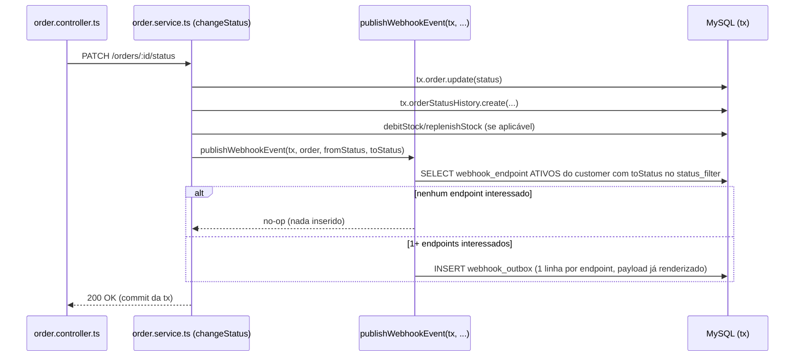

# FDD — Sistema de Webhooks de Notificação de Pedidos

> Este documento detalha o "como implementar" da proposta aprovada no [RFC](RFC.md) e nas ADRs referenciadas ao longo do texto. Pressupõe que o leitor já conhece o contexto de negócio (ver [PRD](PRD.md)) e as decisões arquiteturais individuais (ver `docs/adrs/`).

## Contexto e motivação técnica

O OMS atual não possui nenhum mecanismo de notificação externa, evento ou fila (`src/`, `prisma/` não têm nenhuma menção a webhook/outbox/fila) — esta feature parte de um vácuo arquitetural, não de uma extensão de algo existente. O gatilho de negócio é a mudança de status de pedido, hoje já centralizada em `changeStatus()` (`src/modules/orders/order.service.ts:126-179`), que roda inteiramente dentro de uma única transação Prisma (`$transaction`) atualizando `Order.status`, inserindo em `OrderStatusHistory` e ajustando `Product.stockQuantity`.

A decisão de arquitetura (ADR-001) foi inserir o evento de webhook **dentro dessa mesma transação**, via padrão outbox, e delegar a entrega HTTP a um worker assíncrono dedicado (ADR-002), com resiliência via retry/backoff e DLQ (ADR-003), autenticidade via HMAC-SHA256 (ADR-004), garantia at-least-once com deduplicação por `X-Event-Id` (ADR-005), reuso extensivo dos padrões do OMS (ADR-006) e uma limitação conhecida de ordenação apenas por pedido (ADR-007). Este FDD traduz essas decisões em modelo de dados, fluxos, contratos HTTP e matriz de erros suficientes para o time começar a codar.

## Objetivos técnicos

- Garantir atomicidade entre a mudança de status do pedido e o registro do evento de notificação — nunca existir status mudado sem evento registrado, nem evento registrado sem a mudança ter sido commitada (`[09:41] Diego`: "Se ficar fora da transação, perde a garantia toda").
- Entregar notificações com latência efetiva abaixo de 10 segundos na grande maioria dos casos, via polling de 2 segundos (`[09:02] Marcos`, `[09:09]-[09:10] Diego/Larissa`).
- Sobreviver a indisponibilidades temporárias do endpoint do cliente por até ~15 horas via retry com backoff exponencial, sem perder o evento (`[09:15]-[09:17] Diego`).
- Autenticar e garantir a integridade de cada entrega via HMAC-SHA256, com blast radius de vazamento de secret limitado a um único endpoint (`[09:20]-[09:21] Sofia`).
- Garantir semântica de entrega at-least-once, com um identificador único (`X-Event-Id`) que permita deduplicação client-side (`[09:24]-[09:25] Diego`).
- Não introduzir infraestrutura nova (sem filas externas, sem novo banco): reaproveitar MySQL, Prisma, Pino, `AppError`, `requireRole` e o padrão de módulos já existentes (`[09:07] Diego`, `[09:30] Larissa`).

## Escopo e exclusões

**Em escopo** (decidido na reunião, ver RFC e ADRs): outbox transacional; worker dedicado em polling; retry exponencial + DLQ; CRUD de configuração de webhook por cliente (URL, filtro de status, secret); rotação de secret com grace period de 24h; consulta de histórico de entregas; endpoint administrativo de replay de DLQ; assinatura HMAC-SHA256; TLS obrigatório na URL cadastrada; limite de 64KB por payload.

**Fora de escopo desta feature** (explicitamente descartado ou adiado na reunião — ver também "Questões em aberto" do RFC):
- Notificação proativa ao cliente em caso de falhas recorrentes (ex.: e-mail) — adiado para fase futura (`[09:37]-[09:38] Marcos/Larissa`).
- Rate limiting de envio por cliente — observado, não implementado nesta fase (`[09:38]-[09:39] Diego/Larissa`).
- Dashboard visual para o cliente acompanhar seus webhooks — fica com o time de frontend, fora deste projeto (`[09:39]-[09:40] Marcos/Larissa`).
- Garantia de entrega exactly-once — descartada por complexidade desproporcional (`[09:25] Diego`).
- Escalonamento para múltiplos workers com ordenação global — arquitetura de particionamento/lock pessimista fica para uma fase futura (`[09:12]-[09:13] Diego`, ver ADR-007).
- Arquivamento automático de linhas entregues na outbox (após ~30 dias) — mencionado, mas fora do escopo de implementação desta fase (`[09:08] Diego`).

## Modelagem de dados (visão geral)

Seguindo as convenções já usadas em `prisma/schema.prisma` (`@id @default(uuid()) @db.Char(36)`, `@@map` para tabelas snake_case, índices em colunas de status/timestamp — confirmado nos models `Order`, `OrderItem`, `OrderStatusHistory`), propõe-se:

| Tabela | Campos principais | Origem da decisão |
| --- | --- | --- |
| `webhook_endpoint` | `id`, `customer_id`, `url`, `status_filter` (lista de `OrderStatus`), `secret_current`, `secret_previous` (nulo), `secret_rotated_at` (nulo), `active`, `created_at`, `updated_at` | URL/secret/customer_id/estado ativo (`[09:21] Bruno`); filtro de status por endpoint (`[09:33]-[09:34] Marcos/Bruno`); rotação com grace period (`[09:21] Sofia`) |
| `webhook_outbox` | `id`, `webhook_endpoint_id`, `order_id`, `event_id`, `event_type`, `payload` (JSON, snapshot), `status` (`pending`/`processing`/`delivered`/`failed`), `attempt_count`, `next_attempt_at`, `created_at`, `updated_at` | Padrão outbox (`[09:06] Diego`); índice em status e `created_at` (`[09:08] Diego`); payload snapshot na inserção (`[09:51]-[09:52] Larissa/Diego/Bruno`); `event_id` UUID único (`[09:25] Diego`) |
| `webhook_delivery` | `id`, `webhook_outbox_id`, `event_id`, `success`, `http_status`, `response_excerpt`, `response_time_ms`, `attempted_at` | Histórico de entregas: sucesso/falha, payload, response, tempo de resposta (`[09:34] Marcos`) |
| `webhook_dead_letter` | `id`, `event_id`, `webhook_endpoint_id`, `payload`, `failure_reason`, `created_at` | Tabela separada de DLQ (`[09:18] Diego`) |

Todos os IDs seguem UUID, conforme padrão confirmado pela própria equipe para a outbox (`[09:51] Larissa`: "UUID, segue o padrão do resto do projeto. Tudo é uuid.") e generalizado aqui para as demais tabelas novas, por consistência com o restante do `prisma/schema.prisma`.

## Fluxos detalhados

### 1. Criação do evento na outbox



1. `changeStatus()` (`src/modules/orders/order.service.ts:126-179`) valida a transição com `canTransition` (`order.status.ts`) e, como já faz hoje, atualiza `Order`, insere em `OrderStatusHistory` e ajusta estoque.
2. Antes do commit, dentro do mesmo `tx`, `changeStatus()` chama uma nova função `publishWebhookEvent(tx, order, fromStatus, toStatus)` — proposta por Bruno como uma função pura que recebe o client de transação atual, em vez de injetar um repository inteiro (`[09:41]-[09:42] Bruno/Diego`).
3. `publishWebhookEvent` busca os `webhook_endpoint` ativos do `customer_id` do pedido cujo `status_filter` contenha o `toStatus`. Se nenhum endpoint estiver interessado, **nada é inserido** — o filtro é aplicado na inserção, não no envio, para economizar linhas na tabela (`[09:34] Diego/Bruno`: "Se nenhum webhook do customer quer aquele status, nem insere").
4. Para cada endpoint interessado, insere uma linha em `webhook_outbox` com `event_id` (UUID gerado nesse momento), `event_type = "order.status_changed"`, e o **payload já renderizado** (snapshot do estado do pedido naquele instante, não apenas o `order_id`) — decisão explícita para evitar que mudanças posteriores no pedido alterem o conteúdo de um evento já emitido (`[09:51]-[09:52] Larissa/Diego/Bruno`).
5. Se a inserção na outbox falhar, toda a transação sofre rollback — não existe caso de status mudar sem o evento correspondente ser registrado (`[09:40]-[09:41] Bruno/Diego`).

### 2. Processamento pelo worker

1. O processo `src/worker.ts` (novo entry point, iniciado via `npm run worker`) inicializa sua própria instância de `PrismaClient` (mesma `DATABASE_URL` da API) e entra em loop de polling a cada 2 segundos (`[09:08]-[09:11] Diego`).
2. A cada iteração, a lógica de processamento — proposta como `src/modules/webhooks/webhook.processor.ts` (Bruno também cogitou o nome `webhook.worker.ts`) (`[09:28] Bruno`) — busca um lote pequeno de linhas `webhook_outbox` com `status = 'pending'` e `next_attempt_at <= now()`, ordenadas por `created_at` (ordem de inserção, ver ADR-007).
3. Para cada evento: monta o corpo JSON (payload já snapshotado), calcula a assinatura HMAC-SHA256 sobre o corpo usando a `secret_current` (ou `secret_previous`, se dentro do grace period de 24h) do `webhook_endpoint` (`[09:20]-[09:22] Sofia`), monta os headers (`X-Event-Id`, `X-Signature`, `X-Timestamp`, `X-Webhook-Id`, `Content-Type: application/json` — `[09:44]-[09:45] Diego/Sofia`) e faz um `POST` HTTP para a `url` cadastrada, com timeout de 10 segundos (`[09:42] Diego`).
4. Resposta 2xx dentro do timeout → marca a linha como `delivered` e grava uma entrada de sucesso em `webhook_delivery`.
5. Timeout, erro de rede ou resposta não-2xx → conta como falha (ver fluxo de retry abaixo) e grava uma entrada de falha em `webhook_delivery`.

### 3. Retry com backoff exponencial

1. Em cada falha, o worker incrementa `attempt_count` e recalcula `next_attempt_at` segundo a progressão fixa: 1 minuto, 5 minutos, 30 minutos, 2 horas, 12 horas (`[09:17] Diego`).
2. O evento permanece com `status = 'pending'` (ou `'processing'` durante a tentativa) até esgotar as 5 tentativas.
3. Cada tentativa (sucesso ou falha) é registrada em `webhook_delivery`, alimentando o endpoint de histórico (`GET /webhooks/:id/deliveries`).

### 4. Dead Letter Queue (DLQ)

1. Após a 5ª tentativa falhar, o worker remove (ou marca como `failed` e move) a linha correspondente de `webhook_outbox` e insere uma linha equivalente em `webhook_dead_letter`, com o payload, o motivo da falha (`failure_reason`, ex.: `WEBHOOK_DELIVERY_TIMEOUT`) e o timestamp (`[09:18] Diego`).
2. Um administrador pode reprocessar manualmente via `POST /admin/webhooks/dead-letter/:id/replay`, que recoloca o evento em `webhook_outbox` com `status = 'pending'` e `attempt_count = 0` (`[09:18] Diego`).
3. O replay exige a role `ADMIN` (reuso de `requireRole('ADMIN')`, `src/middlewares/auth.middleware.ts`) e é registrado em log com o usuário que o executou, para auditoria (`[09:35]-[09:36] Sofia/Larissa`).

## Contratos públicos

Todos os endpoints (exceto o de replay administrativo) exigem autenticação via `authenticate` (JWT Bearer) e podem ser chamados por qualquer role autenticada, por decisão explícita da reunião (`[09:36]-[09:37] Marcos/Sofia`: "Por enquanto sim [...] Mais pra frente a gente pode endurecer"). O `customer_id` é sempre passado no corpo/path da requisição, nunca inferido do JWT (`[09:32]-[09:33] Bruno/Larissa`). Os caminhos exatos das rotas (ex.: `/webhooks` vs. `/webhooks/:id/secret/rotate`) não foram ditados na reunião — foram definidos aqui seguindo o padrão de rotas já existente no projeto (`src/routes/index.ts`, prefixos planos por módulo como `/orders`, `/customers`).

### 1. `POST /webhooks` — cadastrar webhook

Requisito de negócio: cadastro com `url`, `secret` gerada pela plataforma e devolvida na criação, lista de status de interesse, `customer_id` explícito (`[09:31]-[09:32] Marcos`).

**Request:**
```json
{
  "customerId": "8f14e45f-ceea-4c1b-9f3b-3c1a2d5e7a90",
  "url": "https://api.clientedominio.com/webhooks/oms",
  "statusFilter": ["SHIPPED", "DELIVERED"]
}
```

**Response `201 Created`:**
```json
{
  "id": "3fa85f64-5717-4562-b3fc-2c963f66afa6",
  "customerId": "8f14e45f-ceea-4c1b-9f3b-3c1a2d5e7a90",
  "url": "https://api.clientedominio.com/webhooks/oms",
  "statusFilter": ["SHIPPED", "DELIVERED"],
  "secret": "whsec_8f2a1c9b7e4d4f0a9c2e6b1d3a5f7c90",
  "active": true,
  "createdAt": "2026-08-26T14:32:10.000Z"
}
```

> Nota de design (FDD, não citada literalmente na reunião): a `secret` completa só é retornada neste momento de criação (e na rotação, endpoint 6) — em qualquer outra leitura (`GET`), o campo `secret` é omitido. Isso segue a exigência de segurança de tratar a secret como dado sensível (`[09:21]-[09:22] Sofia/Diego`), no mesmo espírito do `redact` já aplicado a segredos pelo logger (`src/shared/logger/index.ts`).

Erros: `400 VALIDATION_ERROR` (schema Zod, ex.: `url` ausente ou não-HTTPS — `[09:23] Sofia`), `404 NOT_FOUND` se `customerId` não corresponder a um customer existente (reuso do erro genérico já usado pelos demais módulos, não é um erro específico do módulo de webhooks).

### 2. `GET /webhooks?customerId={id}` — listar webhooks de um customer

Requisito: listar os webhooks de um customer (`[09:33] Bruno`).

**Request:** sem corpo — `customerId` informado via query string, ex.: `GET /webhooks?customerId=8f14e45f-ceea-4c1b-9f3b-3c1a2d5e7a90`.

**Response `200 OK`:**
```json
{
  "data": [
    {
      "id": "3fa85f64-5717-4562-b3fc-2c963f66afa6",
      "customerId": "8f14e45f-ceea-4c1b-9f3b-3c1a2d5e7a90",
      "url": "https://api.clientedominio.com/webhooks/oms",
      "statusFilter": ["SHIPPED", "DELIVERED"],
      "active": true,
      "createdAt": "2026-08-26T14:32:10.000Z"
    }
  ]
}
```

Erros: `400 VALIDATION_ERROR` se `customerId` ausente ou inválido.

### 3. `PATCH /webhooks/:id` — editar webhook

Requisito: edição de `url`, `statusFilter` e/ou `active` (`[09:33] Bruno`).

**Request:**
```json
{
  "statusFilter": ["PAID", "SHIPPED", "DELIVERED"],
  "active": true
}
```

**Response `200 OK`:**
```json
{
  "id": "3fa85f64-5717-4562-b3fc-2c963f66afa6",
  "customerId": "8f14e45f-ceea-4c1b-9f3b-3c1a2d5e7a90",
  "url": "https://api.clientedominio.com/webhooks/oms",
  "statusFilter": ["PAID", "SHIPPED", "DELIVERED"],
  "active": true,
  "createdAt": "2026-08-26T14:32:10.000Z"
}
```
(mesmo formato do item 2, sem o campo `secret`, refletindo os campos atualizados)

Erros: `404 WEBHOOK_NOT_FOUND`, `400 VALIDATION_ERROR`, `422 WEBHOOK_INVALID_URL` (ver Matriz de Erros).

### 4. `DELETE /webhooks/:id` — remover webhook

Requisito: remoção de webhook (`[09:33] Bruno`).

**Request:** sem corpo.

**Response:** `204 No Content` (sem corpo).

Erros: `404 WEBHOOK_NOT_FOUND`.

### 5. `GET /webhooks/:id/deliveries` — histórico de entregas

Requisito: ver os últimos 100 webhooks enviados, sucesso/falha, payload, response, tempo de resposta (`[09:34] Marcos`).

**Request:** sem corpo — `limit` opcional via query string (default e máximo 100).

**Response `200 OK`:**
```json
{
  "data": [
    {
      "eventId": "b6e1c2a4-9f3d-4e2b-8a1c-7d5e9f0a1b2c",
      "success": true,
      "httpStatus": 200,
      "responseTimeMs": 184,
      "attemptedAt": "2026-08-26T14:32:12.500Z"
    },
    {
      "eventId": "a1b2c3d4-5e6f-7890-abcd-ef1234567890",
      "success": false,
      "httpStatus": null,
      "responseTimeMs": 10000,
      "attemptedAt": "2026-08-26T13:10:02.000Z"
    }
  ],
  "limit": 100
}
```

Erros: `404 WEBHOOK_NOT_FOUND`.

### 6. `POST /webhooks/:id/secret/rotate` — rotacionar secret

Requisito: cliente pede nova secret pela API; a antiga permanece válida por 24h em paralelo (`[09:21] Sofia`).

**Request:** sem corpo (ação disparada apenas pelo `id` no path e pela autenticação do chamador).

**Response `200 OK`:**
```json
{
  "id": "3fa85f64-5717-4562-b3fc-2c963f66afa6",
  "secret": "whsec_1a9f8e7d6c5b4a3f2e1d0c9b8a7f6e5d",
  "previousSecretValidUntil": "2026-08-27T14:32:10.000Z"
}
```

Erros: `404 WEBHOOK_NOT_FOUND`, `400 WEBHOOK_SECRET_REQUIRED` (estado inconsistente: endpoint sem secret ativa para rotacionar).

### 7. `POST /admin/webhooks/dead-letter/:id/replay` — reprocessar item em DLQ

Requisito: endpoint administrativo de replay manual, `role ADMIN` obrigatória, com log de auditoria (`[09:18] Diego`, `[09:35]-[09:36] Sofia/Larissa`).

**Request:** sem corpo (ação disparada apenas pelo `id` do item em `webhook_dead_letter`, no path, e pela role `ADMIN` do chamador).

**Response `200 OK`:**
```json
{
  "deadLetterId": "d4e5f6a7-b8c9-40d1-92e3-f4a5b6c7d8e9",
  "outboxEventId": "b6e1c2a4-9f3d-4e2b-8a1c-7d5e9f0a1b2c",
  "status": "pending",
  "replayedBy": "1c2d3e4f-5678-90ab-cdef-1234567890ab"
}
```

Erros: `403 FORBIDDEN` (reuso do erro padrão de `requireRole`, não prefixado com `WEBHOOK_` — ver Matriz de Erros), `404 WEBHOOK_DEAD_LETTER_NOT_FOUND`.

## Matriz de erros

Todos os erros específicos do módulo seguem o padrão já existente de `AppError` (`src/shared/errors/app-error.ts`) e suas subclasses (`src/shared/errors/http-errors.ts`), com códigos prefixados `WEBHOOK_`, no mesmo espírito de `INSUFFICIENT_STOCK`/`INVALID_STATUS_TRANSITION` (`[09:28]-[09:29] Bruno/Larissa`).

| Código | Status HTTP | Quando ocorre | Origem |
| --- | --- | --- | --- |
| `WEBHOOK_NOT_FOUND` | 404 | `GET`/`PATCH`/`DELETE` referenciando um `id` de webhook inexistente | `[09:28] Bruno` (nome do código); extends `NotFoundError` (`src/shared/errors/http-errors.ts`) |
| `WEBHOOK_INVALID_URL` | 422 | Falha de validação de URL em nível de domínio, além do que o schema Zod já cobre (ex.: revalidação em `PATCH`) — a checagem básica de "URL deve ser HTTPS" acontece primeiro como validação de schema Zod e gera `VALIDATION_ERROR` genérico (`[09:23] Sofia`: "isso na verdade nem é decisão arquitetural, é só uma validação no schema Zod") | `[09:28] Bruno` (nome do código); `[09:23] Sofia` (regra de negócio subjacente) |
| `WEBHOOK_SECRET_REQUIRED` | 400 | Tentativa de operação que depende de uma secret ativa (ex.: rotação) num registro em estado inconsistente sem secret configurada | `[09:28] Bruno` (nome do código, salvaguarda de invariante) |
| `WEBHOOK_PAYLOAD_TOO_LARGE` | — (falha registrada internamente, não retornada via HTTP a um chamador da API) | Payload do evento excede 64KB no momento do envio pelo worker; a plataforma opta por falhar o envio em vez de truncar | `[09:23]-[09:24] Sofia/Diego/Larissa` |
| `WEBHOOK_DELIVERY_TIMEOUT` | — (motivo de falha registrado em `webhook_delivery`/`webhook_dead_letter`, não uma resposta HTTP da nossa API) | Chamada HTTP do worker ao endpoint do cliente excede 10 segundos | `[09:42] Diego` |
| `WEBHOOK_DEAD_LETTER_NOT_FOUND` | 404 | `POST /admin/webhooks/dead-letter/:id/replay` referenciando um `id` inexistente em `webhook_dead_letter` | `[09:18] Diego` (existência do endpoint); extends `NotFoundError` |

Erros transversais (não prefixados com `WEBHOOK_`, reaproveitados sem alteração): `VALIDATION_ERROR` (Zod, via `src/middlewares/validate.middleware.ts`), `FORBIDDEN`/`UNAUTHORIZED` (via `authenticate`/`requireRole`, `src/middlewares/auth.middleware.ts`), `CONFLICT`/`NOT_FOUND` genéricos de erros conhecidos do Prisma (`src/middlewares/error.middleware.ts`).

## Estratégias de resiliência

- **Timeout de entrega:** 10 segundos por chamada HTTP do worker ao endpoint do cliente; excedido o timeout, a tentativa é tratada como falha (`[09:42] Diego`).
- **Retry com backoff exponencial:** 5 tentativas, progressão 1m/5m/30m/2h/12h (~15h de janela total) (`[09:15]-[09:17] Diego`).
- **Fallback para DLQ:** esgotadas as tentativas, o evento vai para `webhook_dead_letter`, preservando payload e motivo, sem bloquear o processamento dos demais eventos pendentes na outbox (`[09:18] Diego`).
- **Isolamento de processo:** o worker roda fora do processo da API, garantindo que reinícios de deploy da API não derrubem o processamento de eventos em andamento (`[09:11] Diego`).
- **Atomicidade transacional:** o registro do evento nunca fica dessincronizado da mudança de status, pois ambos ocorrem na mesma transação Prisma (`[09:06], [09:41] Diego/Bruno`, ADR-001).
- **Grace period de secret:** durante a rotação, o worker aceita assinaturas geradas tanto pela secret nova quanto pela antiga por 24h, evitando falhas de autenticação para clientes que ainda não migraram (`[09:21] Sofia`).

## Observabilidade

- **Métricas:** tamanho da fila pendente em `webhook_outbox` (contagem e idade do evento mais antigo pendente), taxa de sucesso/falha de entrega por tentativa, distribuição de tentativas até sucesso (1ª a 5ª), quantidade de eventos movidos para `webhook_dead_letter` por período, latência de entrega (tempo entre `created_at` do evento e o sucesso registrado em `webhook_delivery`). Essas métricas operacionalizam os objetivos técnicos de latência (<10s) e de janela de retry (~15h) definidos na reunião.
- **Logs:** o worker e o módulo HTTP de webhooks usam o logger Pino já existente no projeto (`src/shared/logger/index.ts`), sem introduzir um logger novo (`[09:29] Bruno`). Cada transição de estado relevante é logada de forma estruturada: evento enfileirado, tentativa de entrega (sucesso/falha com `http_status`), evento movido para DLQ, replay administrativo executado (incluindo o usuário responsável, para auditoria — `[09:36] Sofia`). A secret nunca é logada em claro; o padrão de `redact` do logger (`*.password`, `*.token`, headers de auth) deve ser estendido para cobrir também o campo de secret do webhook, seguindo a mesma convenção.
- **Tracing:** o projeto não possui hoje nenhuma infraestrutura de tracing distribuído (não encontrada em `src/`). Na ausência dela, o `event_id` (mesmo valor enviado no header `X-Event-Id`, `[09:25] Diego`) funciona como identificador de correlação de ponta a ponta — da inserção na outbox, passando por cada tentativa de entrega, até um eventual registro em DLQ — permitindo reconstruir o histórico completo de um evento a partir dos logs estruturados, sem depender de uma ferramenta de tracing dedicada.

## Integração com o sistema existente

- **`src/modules/orders/order.service.ts`** — o método `changeStatus()` (linhas 126–179) é estendido para, dentro do mesmo `$transaction` que já atualiza `Order`, insere em `OrderStatusHistory` e ajusta `Product.stockQuantity`, chamar `publishWebhookEvent(tx, order, fromStatus, toStatus)` antes do commit (`[09:40]-[09:42] Bruno/Diego`, ADR-001).
- **`src/modules/orders/order.status.ts`** — o enum `OrderStatus` e a função `canTransition` já definem o grafo de transições válidas do pedido; o `status_filter` de cada `webhook_endpoint` é validado contra esse mesmo enum, e apenas transições que já passam por `changeStatus()` (logo, já validadas por `canTransition`) podem gerar eventos de webhook.
- **`src/shared/errors/app-error.ts` e `src/shared/errors/http-errors.ts`** — os novos erros do módulo (ex.: `WebhookNotFoundError extends NotFoundError`, `WebhookInvalidUrlError extends UnprocessableEntityError`) seguem exatamente o mesmo formato de `AppError` (`statusCode`, `errorCode`, `details`) e o mesmo padrão de subclasses já usado por `InsufficientStockError`/`InvalidStatusTransitionError` (`[09:28]-[09:29] Bruno`, ADR-006).
- **`src/middlewares/error.middleware.ts`** — não sofre nenhuma alteração: por já tratar qualquer `AppError` de forma uniforme (formato `{ error: { code, message, details? } }`), absorve os novos erros `WEBHOOK_*` sem modificação (`[09:29] Bruno`).
- **`src/middlewares/auth.middleware.ts`** — `authenticate` é reaproveitado em todos os endpoints do módulo de webhooks; `requireRole('ADMIN')` é reaproveitado diretamente no endpoint `POST /admin/webhooks/dead-letter/:id/replay` (`[09:35]-[09:36] Sofia/Larissa`, ADR-003).
- **`src/shared/logger/index.ts`** — o logger Pino existente é reutilizado tanto pela API do módulo de webhooks quanto pelo processo `src/worker.ts`, sem introduzir uma nova biblioteca de logging (`[09:29] Bruno`); a lista de `redact` deve ganhar um novo padrão para o campo de secret do webhook.
- **`src/routes/index.ts`** — um novo router do módulo de webhooks (e um router administrativo para o replay de DLQ) é registrado ao lado dos routers já existentes (`/auth`, `/users`, `/customers`, `/products`, `/orders`), seguindo o mesmo padrão de montagem plano por prefixo.
- **`src/middlewares/validate.middleware.ts`** — reaproveitado junto com novos schemas Zod em `src/modules/webhooks/webhook.schemas.ts` (seguindo o padrão de `src/modules/orders/order.schemas.ts`), incluindo a validação de URL HTTPS-only (`[09:23] Sofia`).
- **`prisma/schema.prisma`** — as quatro novas tabelas (`webhook_endpoint`, `webhook_outbox`, `webhook_delivery`, `webhook_dead_letter`) seguem as convenções já em uso nos models `Order`/`OrderItem`/`OrderStatusHistory`: chave primária `@id @default(uuid()) @db.Char(36)`, `@@map` para nome de tabela em snake_case, e índices nas colunas de status e timestamp.

## Dependências e compatibilidade

- **Banco de dados:** MySQL já provisionado via Prisma; nenhuma infraestrutura nova é introduzida (decisão explícita contra Redis/filas externas, `[09:07] Diego/Larissa`, ADR-001).
- **Runtime:** o cálculo de HMAC-SHA256 usa o módulo `crypto` nativo do Node.js, e as chamadas HTTP do worker podem usar o cliente HTTP já nativo do runtime Node atual do projeto — nenhuma nova dependência externa de HTTP client ou criptografia é necessária.
- **Processo adicional:** a operação passa a depender de um novo processo de longa duração (`npm run worker`) rodando em paralelo à API, com sua própria conexão ao banco (`[09:11], [09:29]-[09:30] Diego/Bruno`, ADR-002) — isso é uma mudança de topologia de deploy que precisa ser refletida na infraestrutura de execução (ex.: `docker-compose.yml`/orquestração), fora do escopo documental desta feature.
- **Compatibilidade:** não há alteração de contratos existentes da API de pedidos; a extensão de `changeStatus()` é aditiva (nova chamada dentro da transação) e não muda a assinatura pública do endpoint de mudança de status já existente.

## Critérios de aceite técnicos

- Uma mudança de status bem-sucedida via `changeStatus()` insere, na mesma transação, uma linha em `webhook_outbox` para cada `webhook_endpoint` ativo cujo `status_filter` contenha o novo status; se nenhum endpoint estiver interessado, nenhuma linha é inserida.
- Se a inserção em `webhook_outbox` falhar, a transação inteira sofre rollback (o status do pedido não muda).
- O worker processa eventos pendentes em lotes, respeitando a ordem de `created_at`, com um ciclo de polling de 2 segundos.
- Uma falha de entrega reagenda a próxima tentativa exatamente conforme a progressão 1m/5m/30m/2h/12h, até o limite de 5 tentativas.
- Esgotadas as 5 tentativas, o evento é removido de `webhook_outbox` e uma linha equivalente aparece em `webhook_dead_letter`, com motivo de falha preenchido.
- `POST /admin/webhooks/dead-letter/:id/replay` só é acessível a usuários com role `ADMIN`, recoloca o item em `webhook_outbox` como pendente e gera um registro de auditoria com o usuário que executou o replay.
- Toda entrega inclui os headers `X-Event-Id`, `X-Signature`, `X-Timestamp`, `X-Webhook-Id` e `Content-Type: application/json`; a assinatura em `X-Signature` valida corretamente contra HMAC-SHA256 usando a secret do endpoint.
- Durante o grace period de 24h após uma rotação de secret, tanto a secret nova quanto a antiga produzem assinaturas aceitas para aquele endpoint; após esse período, apenas a nova.
- `GET /webhooks/:id/deliveries` retorna no máximo 100 registros, ordenados do mais recente para o mais antigo, cada um indicando sucesso/falha, status HTTP, tempo de resposta e horário da tentativa.
- Eventos com payload acima de 64KB não são enviados; a falha é registrada, não há truncamento silencioso.

## Riscos e mitigação

| Risco | Mitigação | Origem |
| --- | --- | --- |
| Endpoint do cliente fica indisponível por horas (ex.: manutenção planejada) e o evento se perde | Janela de retry de ~15h antes de mover para DLQ, com reprocessamento manual disponível depois disso | `[09:16]-[09:18] Diego` |
| Secret de cliente vaza (já ocorreu antes, em log de aplicação do cliente) | Secret exclusiva por endpoint (não global) + rotação com grace period de 24h, contendo o impacto a um único cliente | `[09:21]-[09:22] Sofia/Diego` |
| Tabela `webhook_outbox` cresce indefinidamente, degradando leitura do worker | Índices em `status` e `created_at`; arquivamento de linhas entregues após ~30 dias (mecanismo de arquivamento fora do escopo de implementação desta fase) | `[09:08] Diego` |
| Worker único vira gargalo de vazão à medida que o volume de pedidos cresce | Aceito como limitação conhecida por ora (ADR-007); escalonamento requer redesenho futuro (particionamento por `order_id` ou lock pessimista) | `[09:12]-[09:13] Diego` |
| Cliente recebe o mesmo evento duas vezes (at-least-once) e processa duplicado do lado dele | `X-Event-Id` único por evento, documentado para o cliente implementar deduplicação; comportamento é padrão de mercado (Stripe, GitHub) | `[09:24]-[09:26] Diego/Sofia/Marcos` |
| API reinicia (deploy) e o processamento de eventos para junto | Worker roda como processo Node separado (`src/worker.ts`), com ciclo de vida independente da API | `[09:11] Diego` |
